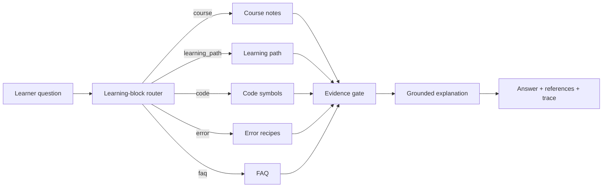

<div align="center">

# StuckToShip

### An AI engineering course tutor that helps learners get unstuck and build the project.

<p>
  <strong>English</strong> | <a href="README.zh-CN.md">简体中文</a>
</p>

StuckToShip is for learners building LLM apps, RAG pipelines, LangGraph workflows, Milvus retrieval, MCP tools, and Agents.

It connects course notes, project code, setup errors, FAQ, and evaluation traces so the tutor can explain the concept, point to the code, diagnose the error, and suggest the next step.

[Quick Start](#quick-start) | [Why StuckToShip](#why-stucktoship) | [Features](#features) | [Data](#bring-your-course-data) | [Evaluation](#evaluation) | [Roadmap](#roadmap)


</div>

---

## Why StuckToShip

Students do not need another chatbot that sounds confident. They need help moving through real AI engineering blocks:

- "I understand RAG in theory, but where is it in this project?"
- "The lesson explains LangGraph, but I cannot see how the workflow runs."
- "Milvus / LangChain / DashScope failed. Which step is actually broken?"
- "Should I learn chunking, reranking, evaluation, MCP, or Agents next?"
- "The answer looks right, but what course note or code file supports it?"
- "I changed retrieval or prompt logic. Did quality improve or regress?"

The product bet is simple:

> A useful AI course tutor should turn a stuck moment into the next concrete action.

That means it should route the question, retrieve from the right source, explain at the learner's level, cite the lesson or code, refuse when evidence is weak, and be evaluated like real software.

Trust and citations are the baseline. The real value is helping the learner move from "I am stuck" to "I understand it and can build it."

## What You Can Ask

```text
What problem does RAG solve in LLM applications?
Give me an Agent RAG learning path.
Where is create_app defined in main.py?
Why does chunk size affect answer quality?
ModuleNotFoundError: No module named pymilvus
How do I configure DashScope API Key?
```

Each answer can return:

```json
{
  "route": "course",
  "answer": "...",
  "references": [
    {
      "source_file": "knowledge/courses/rag-basics.md",
      "source_type": "course_note",
      "score": 6.0
    }
  ],
  "trace": {
    "route_reason": "default_course_route",
    "decision": "accept",
    "latency_ms": 12
  }
}
```

## Features

| Feature | Status |
|---|---|
| Learning-block router | Classifies course, learning path, code, error, and FAQ questions |
| Course-note Q&A | Reads Markdown/TXT lessons from `knowledge/courses/` |
| Learning-path answers | Routes roadmap questions to course-outline evidence |
| Codebase Q&A | Indexes Python symbols with AST parsing |
| Error diagnosis | Matches structured setup and runtime error recipes |
| FAQ first | Handles repeated setup/course questions quickly |
| Evidence gate | Refuses or clarifies when evidence is too weak |
| Citations | Returns source file, source type, score, and text |
| Trace | Shows route, candidates, decision, citations, and latency |
| Streaming | Supports SSE through `/api/v1/rag/ask-stream` |
| Web UI | Chat, references, route pill, trace preview, evaluation page |
| Evaluation | 32-case Agent course eval set, currently 32/32 route accuracy |
| Full vector retrieval | Docker Milvus config included |

## Quick Start

Use a project-local virtual environment. Do not install dependencies into global Python.

```powershell
cd C:\path\to\stucktoship

py -3.12 -m venv .venv
.\.venv\Scripts\python.exe -m pip install -r requirements.txt
Copy-Item .env.example .env

.\.venv\Scripts\python.exe -m uvicorn main:app --host 127.0.0.1 --port 8010
```

Open:

```text
http://127.0.0.1:8010
```

Health check:

```powershell
Invoke-RestMethod http://127.0.0.1:8010/health
```

## API Example

```powershell
$body = @{
  query = "What problem does RAG solve in LLM applications?"
  stream = $false
} | ConvertTo-Json

Invoke-RestMethod `
  -Method Post `
  -Uri http://127.0.0.1:8010/api/v1/rag/ask `
  -ContentType application/json `
  -Body $body
```

Streaming endpoint:

```text
POST /api/v1/rag/ask-stream
```

Evaluation history:

```text
GET /api/v1/evaluation/history?limit=50
```

## How It Works



Important files:

| File | Purpose |
|---|---|
| `main.py` | FastAPI app factory and runtime setup |
| `services/rag_service.py` | API-facing RAG service, SSE, orchestrator handoff |
| `core/qa_orchestrator.py` | Main Agent-course Q&A flow |
| `core/intent_router.py` | Route classifier |
| `core/course_retriever.py` | Course-note retrieval |
| `core/evidence.py` | Evidence packet construction |
| `core/retrieval_gate.py` | Evidence decision |
| `ingestion/code_indexer.py` | Python code symbol extraction |
| `evaluation/agent_course_eval.py` | Offline Agent-course evaluation |
| `static/index.html` | Single-file web console |

## Bring Your Course Data

Put MVP data here:

```text
knowledge/
  courses/    # lessons, outlines, PPT text, transcripts
  faq/        # FAQ JSONL
  errors/     # error recipes JSONL
```

Seed data included:

```text
12 course documents
15 FAQ rows
10 error recipes
40 evaluation questions
60 public learner-question seeds
```

To make the tutor useful, add real course assets in this order:

1. Questions students actually ask.
2. Lesson notes, project walkthroughs, subtitles, and slides converted to Markdown.
3. Setup errors and verified fix commands.
4. Project README, config files, entrypoints, and important source files.
5. A small eval set with answerable, ambiguous, and should-refuse questions.

Validated import:

```powershell
.\.venv\Scripts\python.exe scripts\edu_rag.py import-course C:\path\to\my-course-data --overwrite
```

Expected source layout:

```text
my-course-data/
  courses/  # .md / .txt lessons
  faq/      # JSONL with question + answer
  errors/   # JSONL with error_pattern + symptom + cause + fix_steps
  eval/     # JSONL with question + expected_route + should_answer
```

See [`docs/course-data-requirements.md`](docs/course-data-requirements.md) for exact fields, minimum data volume, and cleaning rules.

Minimum useful private dataset:

```text
10-30 lessons
50-100 FAQ rows
20-50 error recipes
50-100 eval questions
1-3 project codebases
```

## Evaluation

Offline route evaluation:

```powershell
.\.venv\Scripts\python.exe -m evaluation.agent_course_eval --file data/agent_course_eval/manual_v1.jsonl --json
```

Current result:

```text
total: 32
correct: 32
route_accuracy: 1.0
```

Full regression:

```powershell
.\.venv\Scripts\python.exe -m pytest -q
```

Current result:

```text
111 passed, 8 warnings
```

## Milvus

Local course/FAQ/error/code retrieval runs without Milvus on Windows. Use Docker Milvus when you want uploaded documents and full vector retrieval.

```powershell
docker compose -f docker-compose.milvus.yml up -d
$env:STUCKTOSHIP_MILVUS_URI = "http://127.0.0.1:19530"
.\.venv\Scripts\python.exe -m uvicorn main:app --host 127.0.0.1 --port 8010
```

Stop it:

```powershell
docker compose -f docker-compose.milvus.yml down
```

## Configuration

Common `.env` values:

```text
LLM_API_KEY=ollama
LLM_BASE_URL=http://localhost:11434/v1
LLM_MODEL=glm-4.7-flash

APP_MODE=agent_course
ENABLE_TRACE=true
ENABLE_EVALUATION_API=true
KNOWLEDGE_DIR=./knowledge
CODE_RAG_ROOTS=.
EVAL_DATASET=./data/agent_course_eval/manual_v1.jsonl
STUCKTOSHIP_MILVUS_URI=./stucktoship_milvus.db
STUCKTOSHIP_API_KEYS=
```

Use any OpenAI-compatible model server: Ollama, DashScope, OpenAI-compatible gateways, or your own proxy.

## Roadmap

- [x] Course, code, FAQ, error, and learning-path routing
- [x] Citations and trace in API and UI
- [x] Offline Agent-course eval set
- [x] External Milvus compose file
- [x] Course-data import CLI
- [x] Prompt-injection guard for retrieved documents
- [x] API key auth, basic document ACL, and production Docker template
- [ ] Better hybrid retrieval and rerank dashboard
- [ ] Dataset, chunk, prompt, and model versioning
- [ ] Feedback-to-FAQ and feedback-to-error-recipe workflow

## FAQ

### The page does not open.

Check the terminal:

```text
Uvicorn running on http://127.0.0.1:8010
GET / HTTP/1.1" 200 OK
```

If you see `200 OK`, the app is serving the page. Hard refresh the browser with `Ctrl+F5`.

### Evaluation API returns 404.

Restart the server and make sure `.env` does not override:

```text
ENABLE_EVALUATION_API=false
```

### `/health` says `milvus_unavailable`.

That is acceptable for the local MVP on Windows. Start Docker Milvus only when you need uploaded-document vector retrieval.

## Why This Repo Is Different

Most RAG demos optimize for answering. StuckToShip optimizes for learning progress.

The unit of value is not a polished paragraph. It is:

- What am I stuck on?
- What lesson, code file, or error recipe supports the answer?
- What should I try next?
- What should the tutor refuse to answer because evidence is weak?
- Did a retrieval, prompt, or routing change make the system better or worse?

If you want a RAG portfolio project that looks engineered rather than improvised, start here.
