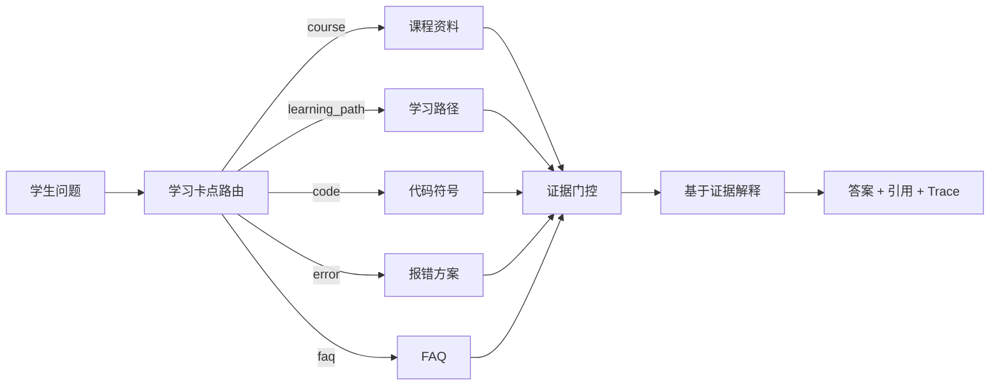

<div align="center">

# StuckToShip

### 从卡住到做出来的 AI 工程课程助教。

<p>
  <a href="README.md">English</a> | <strong>简体中文</strong>
</p>

StuckToShip 面向正在学习大模型应用、RAG、LangGraph、Milvus、MCP 和 Agent 的人。

它把课程讲义、项目代码、FAQ、报错经验和评估记录连起来，帮助学生知道自己卡在哪里、为什么卡、下一步怎么做。

[快速开始](#快速开始) | [为什么值得用](#为什么值得用) | [功能](#功能) | [数据](#放入你的课程数据) | [评估](#评估) | [路线图](#路线图)


</div>

---

## 为什么值得用

学 AI 工程最痛的不是没人解释概念，而是卡点总是混在一起：

- 课上讲了 RAG，但项目里到底在哪里实现？
- 文档看了，但代码还是跑不起来。
- 报错日志里一堆依赖、配置、API Key、向量库问题，哪个才是根因？
- 问普通 ChatGPT，回答很顺，但和当前课程、当前代码对不上。
- 知道要学 LangGraph、MCP、reranking、evaluation，却不知道先学哪个。
- 改了切片、检索或 prompt，效果到底变好了还是变差了？

StuckToShip 的核心判断很简单：

> 好的 AI 课程助教，不应该只回答问题。它应该把学生从“我卡住了”带到“我懂了，也能做出来”。

所以它会先判断问题类型，再去找课程、代码、报错或 FAQ 证据，用听得懂的方式解释，并给出下一步。可信、有出处是底线；真正的价值是帮学习者打通卡点。

## 你可以问什么

```text
RAG 在大模型应用里到底解决什么问题？
请给我一个 Agent RAG 的学习路径。
create_app 在 main.py 里是怎么启动项目的？
为什么 chunk size 会影响答案质量？
ModuleNotFoundError: No module named pymilvus
DashScope API Key 怎么配置？
```

一次回答可以带回：

```json
{
  "route": "course",
  "answer": "...",
  "references": [
    {
      "source_file": "knowledge/courses/rag-basics.md",
      "source_type": "course_note",
      "score": 6.0
    }
  ],
  "trace": {
    "route_reason": "default_course_route",
    "decision": "accept",
    "latency_ms": 12
  }
}
```

## 功能

| 功能 | 当前状态 |
|---|---|
| 学习卡点路由 | 识别课程、学习路径、代码、报错和 FAQ 问题 |
| 课程资料答疑 | 从 `knowledge/courses/` 读取 Markdown/TXT 课程资料 |
| 学习路径推荐 | 把 roadmap 类问题路由到课程大纲证据 |
| 代码库问答 | 用 Python AST 建立符号索引 |
| 报错诊断 | 匹配结构化 setup/runtime error recipe |
| FAQ 优先 | 高频问题先走 FAQ，减少无意义生成 |
| 证据门控 | 证据不足时拒答或追问 |
| 引用 | 返回来源文件、来源类型、分数和文本 |
| Trace | 展示路由、候选证据、门控决策、引用和延迟 |
| 流式输出 | 支持 `/api/v1/rag/ask-stream` |
| Web 控制台 | 聊天、引用面板、route pill、trace preview、评估页 |
| 离线评估 | 32 条 Agent 课程评估集，当前路由准确率 32/32 |
| 完整向量检索 | 已提供 Docker Milvus 配置 |

## 快速开始

每个项目都必须使用独立 `.venv`，不要把依赖装进全局 Python。

```powershell
cd C:\path\to\stucktoship

py -3.12 -m venv .venv
.\.venv\Scripts\python.exe -m pip install -r requirements.txt
Copy-Item .env.example .env

.\.venv\Scripts\python.exe -m uvicorn main:app --host 127.0.0.1 --port 8010
```

打开：

```text
http://127.0.0.1:8010
```

健康检查：

```powershell
Invoke-RestMethod http://127.0.0.1:8010/health
```

## API 示例

```powershell
$body = @{
  query = "RAG 在大模型应用里到底解决什么问题？"
  stream = $false
} | ConvertTo-Json

Invoke-RestMethod `
  -Method Post `
  -Uri http://127.0.0.1:8010/api/v1/rag/ask `
  -ContentType application/json `
  -Body $body
```

流式接口：

```text
POST /api/v1/rag/ask-stream
```

评估历史：

```text
GET /api/v1/evaluation/history?limit=50
```

## 它怎么工作



关键文件：

| 文件 | 作用 |
|---|---|
| `main.py` | FastAPI app factory 和运行时初始化 |
| `services/rag_service.py` | RAG 服务入口、SSE、orchestrator 接入 |
| `core/qa_orchestrator.py` | Agent 课程问答主流程 |
| `core/intent_router.py` | 问题路由 |
| `core/course_retriever.py` | 课程资料检索 |
| `core/evidence.py` | 构建证据包 |
| `core/retrieval_gate.py` | 证据门控 |
| `ingestion/code_indexer.py` | Python 代码符号抽取 |
| `evaluation/agent_course_eval.py` | 离线评估 |
| `static/index.html` | 单文件 Web 控制台 |

## 放入你的课程数据

MVP 数据放这里：

```text
knowledge/
  courses/    # 课程讲义、大纲、PPT 转文本、字幕
  faq/        # 高频问题 JSONL
  errors/     # 报错解决方案 JSONL
```

仓库自带种子数据：

```text
12 course documents
15 FAQ rows
10 error recipes
40 evaluation questions
```

要让它真正好用，按这个顺序补数据：

1. 学员真实问过的问题。
2. 课程讲义、项目讲解、字幕、PPT 转 Markdown。
3. 环境报错和验证过的修复命令。
4. 项目 README、配置文件、入口文件、关键源码。
5. 包含可回答、模糊、应该拒答问题的小评估集。

验证后导入：

```powershell
.\.venv\Scripts\python.exe scripts\edu_rag.py import-course C:\path\to\my-course-data --overwrite
```

源目录格式：

```text
my-course-data/
  courses/  # .md / .txt 课程资料
  faq/      # JSONL，必须有 question + answer
  errors/   # JSONL，必须有 error_pattern + symptom + cause + fix_steps
  eval/     # JSONL，必须有 question + expected_route + should_answer
```

具体字段、最小数据量和清洗规则见 [`docs/course-data-requirements.md`](docs/course-data-requirements.md)。

建议的最小私有数据量：

```text
10-30 篇课程资料
50-100 条 FAQ
20-50 条报错方案
50-100 条评估问题
1-3 个课程项目代码库
```

## 评估

离线路由评估：

```powershell
.\.venv\Scripts\python.exe -m evaluation.agent_course_eval --file data/agent_course_eval/manual_v1.jsonl --json
```

当前结果：

```text
total: 32
correct: 32
route_accuracy: 1.0
```

完整回归测试：

```powershell
.\.venv\Scripts\python.exe -m pytest -q
```

当前结果：

```text
111 passed, 8 warnings
```

## Milvus

Windows 本地的课程、FAQ、报错和代码检索可以不依赖 Milvus 运行。

如果你要上传文档并做完整向量检索，启动 Docker Milvus：

```powershell
docker compose -f docker-compose.milvus.yml up -d
$env:STUCKTOSHIP_MILVUS_URI = "http://127.0.0.1:19530"
.\.venv\Scripts\python.exe -m uvicorn main:app --host 127.0.0.1 --port 8010
```

停止：

```powershell
docker compose -f docker-compose.milvus.yml down
```

## 配置

常用 `.env`：

```text
LLM_API_KEY=ollama
LLM_BASE_URL=http://localhost:11434/v1
LLM_MODEL=glm-4.7-flash

APP_MODE=agent_course
ENABLE_TRACE=true
ENABLE_EVALUATION_API=true
KNOWLEDGE_DIR=./knowledge
CODE_RAG_ROOTS=.
EVAL_DATASET=./data/agent_course_eval/manual_v1.jsonl
STUCKTOSHIP_MILVUS_URI=./stucktoship_milvus.db
STUCKTOSHIP_API_KEYS=
```

只要是 OpenAI-compatible 模型服务都可以接：Ollama、DashScope、OpenAI-compatible gateway 或你自己的代理。

## 路线图

- [x] 课程、代码、FAQ、报错、学习路径路由
- [x] API 和 UI 返回引用与 trace
- [x] Agent 课程离线评估集
- [x] 外部 Milvus Compose 配置
- [x] 课程数据导入 CLI
- [x] 检索文档 Prompt Injection 防护
- [x] API Key 认证、基础文档 ACL、生产 Docker 模板
- [ ] 更强的混合检索和 rerank 评估面板
- [ ] 数据集、chunk、prompt、model 版本追踪
- [ ] 反馈到 FAQ / error recipe 的半自动闭环

## 常见问题

### 页面打不开？

先看终端有没有：

```text
Uvicorn running on http://127.0.0.1:8010
GET / HTTP/1.1" 200 OK
```

如果有 `200 OK`，说明服务已经返回页面。浏览器按 `Ctrl+F5` 强刷。

### 评估接口 404？

重启服务，并确认 `.env` 没有覆盖成：

```text
ENABLE_EVALUATION_API=false
```

### `/health` 显示 `milvus_unavailable`？

Windows 本地 MVP 可以接受。只有上传文档后的完整向量检索需要 Docker Milvus。

## 为什么这个仓库不只是聊天框

大多数 RAG demo 优化的是“能回答”。StuckToShip 优化的是“能推进学习”。

它真正关心的不是一段漂亮话，而是：

- 我到底卡在哪？
- 哪段课程、哪个代码文件、哪条报错方案支持这个回答？
- 我下一步应该试什么？
- 证据不足时，助教应该拒答什么？
- 检索、prompt 或路由改动之后，系统到底变好还是变差？

如果你想做一个看起来像认真工程项目的 RAG 作品集，而不是又一个套壳聊天框，可以从这里开始。
