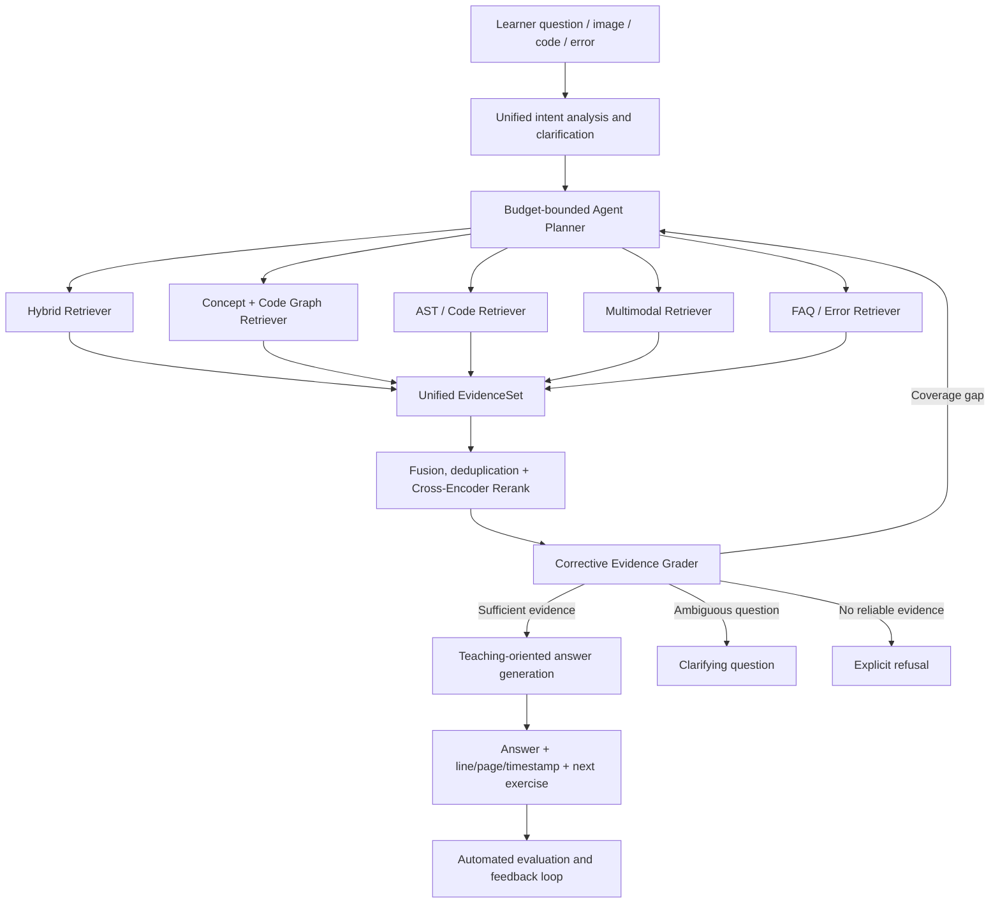

## Context

StuckToShip is a FastAPI application for learners studying AI engineering, LLM applications, RAG, LangGraph, MCP, and agents. The repository already contains:

- A synchronous `QAOrchestrator` that routes course, code, FAQ, error, learning-path, and clarification questions.
- A separate asynchronous LangGraph flow with Milvus dense search, local BM25, RRF fusion, query expansion/decomposition, cross-encoder reranking, corrective retries, refusal, and streaming generation.
- Python AST symbol extraction, source citations, prompt-injection filtering, document ACL checks, trace capture, and offline evaluation.

`RAGService.ask()` currently calls `QAOrchestrator` first and enters the LangGraph flow only when the first path does not return cited evidence. Course questions therefore often use token overlap instead of the stronger hybrid pipeline, and the two paths expose different behavior and traces.

The product goal is not to advertise several RAG architectures. Learners should ask one question; the system should select the evidence path that best explains the concept, code, error, relationship, diagram, slide, or video segment.

Constraints:

- Keep one FastAPI application and the existing `/api/v1/rag/ask` and `/api/v1/rag/ask-stream` interfaces.
- Use the project-local `.venv` for all Python commands and dependencies.
- Reuse LangGraph, Milvus, SQLite/SQLAlchemy, BM25, AST indexing, reranking, ACL, prompt-injection checks, and evaluation code already present.
- Keep Windows local development functional when external Milvus or GPU-only multimodal models are unavailable.
- No answer may bypass evidence safety, ACL, corrective grading, citation construction, or trace capture.

## Goals / Non-Goals

**Goals:**

- Replace the current two-path orchestration with one asynchronous evidence-gated answer flow.
- Use Hybrid RAG as the default retrieval backbone for course and uploaded-document evidence.
- Add relationship-aware retrieval for AI prerequisites, concept dependencies, code calls, configuration dependencies, errors, and fixes.
- Add a bounded planner that selects retrieval tools without unbounded autonomous loops.
- Add page-, slide-, image-, and timestamp-level multimodal evidence.
- Preserve reliable citations across text, code, graph paths, images, slides, and video.
- Measure quality with versioned datasets and release gates rather than subjective demos.

**Non-Goals:**

- Do not create separate products or endpoints for Hybrid RAG, GraphRAG, Agentic RAG, and Multimodal RAG.
- Do not add a general-purpose autonomous agent, arbitrary shell execution, arbitrary Python execution, or unrestricted web browsing.
- Do not add Neo4j before SQLite graph retrieval reaches a measured scale or query limitation.
- Do not make ColPali or a GPU mandatory for the first multimodal release.
- Do not build an LMS, payment system, CRM, course-authoring suite, or video hosting platform.
- Do not rewrite the frontend framework during the retrieval architecture work.

## Architecture



The external seam remains `RAGService.ask()` and `RAGService.ask_stream()`. Internally, retrieval adapters satisfy one small interface and return one evidence type:

```python
@dataclass(frozen=True)
class RetrievalQuery:
    text: str
    route: str
    user_id: str | None
    filters: dict[str, str]

@dataclass(frozen=True)
class EvidenceCandidate:
    id: str
    text: str
    source_path: str
    source_type: str
    modality: str
    location: dict[str, int | float | str]
    raw_scores: dict[str, float]
    retrieval_strategy: str
    metadata: dict[str, object]

class Retriever(Protocol):
    async def retrieve(self, query: RetrievalQuery) -> list[EvidenceCandidate]: ...
```

Callers learn only the retrieval query and evidence result. Dense search, BM25, AST matching, graph traversal, page rendering, and VLM calls remain adapter implementation details.

## Decisions

### Decision: Replace The Two Paths With One Orchestration Path

`RAGService` will no longer return a `QAOrchestrator` result before the LangGraph path. FAQ/error exact matches and deterministic code lookups become fast retrieval adapters inside the same graph. Every answer then crosses the same rerank, safety, gate, citation, generation, persistence, and evaluation nodes.

Alternative considered: keep the current early-return path and add more capabilities to it. Rejected because every new retrieval mode would require duplicate gating, trace, streaming, and evaluation behavior.

### Decision: Normalize Evidence Before Fusion

All adapters return `EvidenceCandidate`. The normalized record carries stable identity, text, source, modality, exact location, raw scores, strategy, and security metadata. Fusion operates on stable identity and preserves raw scores for observability; only the reranker score controls final evidence acceptance.

Alternative considered: continue passing untyped dictionaries with adapter-specific fields. Rejected because field drift already causes separate citation and trace formatting paths.

### Decision: Hybrid Retrieval Is The Default Backbone

Course and uploaded-document retrieval uses dense semantic search and sparse keyword search, fuses candidates with RRF, deduplicates by stable evidence identity, then applies the existing cross-encoder reranker. Exact FAQ, error, and AST matches join the same candidate set with provenance rather than bypassing quality controls.

The current embedding and reranker remain defaults until benchmark data proves another model improves retrieval quality at acceptable latency. BGE-M3 and newer rerankers are experiments, not unconditional dependency changes.

Alternative considered: replace all retrieval with one embedding model. Rejected because API names, file paths, stack traces, configuration keys, and symbols require lexical or structural matching.

### Decision: Build A Teaching Graph, Not A Generic Entity Graph

Graph nodes are limited to `concept`, `lesson`, `symbol`, `config`, `error`, `exercise`, and `project`. Edges are limited to `prerequisite_of`, `explained_in`, `implements`, `calls`, `configured_by`, `causes`, `fixed_by`, `example_of`, and `compared_with`.

Initial graph facts come from explicit course metadata, curated prerequisite records, Python AST imports/calls, configuration references, and validated error recipes. LLM extraction may propose facts but cannot publish them without schema validation and source evidence.

SQLite/SQLAlchemy stores nodes and edges. Retrieval uses entity linking plus bounded one- or two-hop traversal. Community summaries and a dedicated graph database are deferred until graph size or query latency demonstrates a need.

Alternative considered: run generic entity extraction and community detection over every document. Rejected because it produces noisy relationships and adds cost without improving the core teaching questions at current data scale.

### Decision: Use A Bounded Planner With A Deterministic Fast Path

FAQ exact matches, known errors, direct code symbols, and simple course queries use deterministic plans. Complex, multi-hop, comparison, or multimodal questions may use an LLM planner that selects from registered tools only.

Each plan has at most three tool calls and the corrective loop has at most two retrieval retries. Independent tool calls may run concurrently. The planner must stop when evidence is accepted, a clarification is required, the budget is exhausted, or all safe tools return no evidence.

Alternative considered: a general ReAct loop. Rejected because unbounded planning increases latency, cost, and failure modes while making regression tests nondeterministic.

### Decision: Add Multimodal Retrieval In Two Levels

Level 1 stores extracted text plus location-preserving assets: PDF pages, PPT slides, diagrams, code screenshots, transcript segments, keyframes, page numbers, slide numbers, and timestamps. Text and metadata retrieval selects candidate assets; a configured vision-capable model interprets only top-ranked visual evidence.

Level 2 benchmarks a visual document retriever such as ColPali against the Level 1 baseline. It is enabled only if it materially improves visual page Recall@5 and the deployment has the required compute. Text-only local development remains available.

Raw video transcription is outside the first multimodal release. The import contract accepts transcript segments and optional keyframes generated by a separate preprocessing job, preserving a small application interface and avoiding a mandatory FFmpeg/ASR runtime.

Alternative considered: make every PDF page and video frame pass through a VLM during ingestion. Rejected because it creates high ingestion cost and slow reindexing before visual retrieval value is measured.

### Decision: Corrective RAG Is A Shared Quality Layer

Corrective behavior remains part of the unified graph rather than a separately exposed architecture. The grader considers reranker confidence, subquery coverage, source presence, ACL/injection filtering, graph path completeness, and required modality coverage.

Actions are limited to `accept`, `retry`, `clarify`, and `abstain`. A retry may rewrite the query, use step-back/HyDE, repair missing subqueries, add graph expansion, or switch between text and visual retrieval. No path can retry more than twice.

### Decision: Evaluation Is A Release Gate

Every evaluation run records dataset version, chunk configuration, embedding model, reranker model, planner version, prompt version, graph snapshot, multimodal extractor version, latency, and model usage.

Initial release gates are:

- Route/tool selection accuracy at least `0.90`.
- Hybrid retrieval Recall@10 at least `0.85` and nDCG@10 at least `0.70` on at least 100 labeled retrieval cases.
- Citation precision at least `0.95` and groundedness at least `0.90`.
- Refusal F1 at least `0.85` on answerable, ambiguous, out-of-scope, and unsafe cases.
- Graph multi-hop correctness at least `0.80` and at least 10 percentage points above the Hybrid-only baseline on graph-required questions.
- Multimodal page Recall@5 at least `0.80` on visual questions.
- Streaming first-token P95 at most 3 seconds and full-answer P95 at most 15 seconds in the documented production benchmark environment.

Thresholds may change only through a reviewed spec update with a recorded baseline; implementation code must not silently weaken them.

## Data Flow

### Ingestion

```text
course/code/multimodal asset
  -> source-specific loader
  -> normalized asset + security metadata
  -> text/code/graph/visual extraction
  -> stable evidence identities
  -> Milvus text index + SQLite graph/asset metadata
  -> versioned ingestion manifest
```

### Answer

```text
request
  -> intent and clarification
  -> deterministic or bounded plan
  -> selected retrieval adapters
  -> normalized EvidenceCandidate list
  -> ACL and prompt-injection filtering
  -> fusion, deduplication, reranking
  -> corrective evidence decision
  -> answer, clarification, or refusal
  -> citations, trace, persistence, evaluation capture
```

## Security And Reliability

- ACL and prompt-injection checks apply to text extracted from every modality and every graph source.
- Planner tools are registered in code; user text cannot introduce a tool name, URL, command, or executable action.
- Visual assets retain the same owner/visibility metadata as their source document.
- Model failures, unavailable Milvus, unavailable visual models, and malformed graph data degrade to safe adapters or explicit refusal; they do not bypass the evidence gate.
- Traces redact API keys, authorization headers, full system prompts, and private source content not authorized for the requesting user.

## Migration Plan

1. Add the normalized retrieval contract and adapter tests without changing the production path.
2. Wrap existing Hybrid, AST, FAQ, and error retrieval behind adapters.
3. route all non-streaming and streaming answers through one LangGraph flow; remove the early-return branch after parity tests pass.
4. Enable unified Hybrid retrieval by default and capture a baseline evaluation report.
5. Add the teaching graph behind `ENABLE_GRAPH_RETRIEVAL=false`, populate a validated graph, pass graph evaluations, then enable it.
6. Add the bounded planner behind `ENABLE_AGENT_PLANNER=false`, pass budget/trace tests, then enable it for complex queries.
7. Add multimodal ingestion and retrieval behind `ENABLE_MULTIMODAL_RETRIEVAL=false`, pass visual evaluation, then enable it where a vision model is configured.
8. Run the complete regression, security, retrieval, graph, multimodal, latency, and browser smoke suites before release.

Rollback is flag-based for Graph, Agent Planner, and Multimodal retrieval. The unified evidence contract and one-path orchestration become permanent after parity tests because restoring the duplicate early-return path would reintroduce inconsistent quality controls.

## Risks / Trade-offs

- [Unified migration changes all answers] -> Add parity fixtures for every current route and migrate adapters before removing the early return.
- [Hybrid and visual models increase latency] -> Use deterministic fast paths, concurrent independent retrieval, top-K limits, lazy model loading, and measured release budgets.
- [Graph extraction creates false relationships] -> Prefer deterministic sources, require source evidence on every edge, validate edge types, and evaluate graph paths separately.
- [Multimodal processing requires extra compute] -> Keep text-first retrieval functional, invoke vision only for top-ranked evidence, and make visual retrieval opt-in.
- [Planner loops increase cost or fail to stop] -> Enforce three tool calls, two retries, explicit terminal states, timeouts, and trace assertions.
- [One score is not comparable across retrievers] -> Preserve raw adapter scores for diagnostics, use rank fusion for recall, and use normalized reranker scores for acceptance.
- [Evaluation targets overfit a small dataset] -> Separate development and held-out sets, version datasets, and add real learner failures only after review.

## Open Questions

No question blocks Phase 1. Later model choices are benchmark gates with explicit defaults:

- Keep `BAAI/bge-small-zh-v1.5` until BGE-M3 or another candidate beats the current Hybrid baseline without violating latency limits.
- Keep `BAAI/bge-reranker-base` until another reranker improves nDCG@10 and citation precision on the same frozen dataset.
- Ship text-first multimodal retrieval first; enable ColPali-style retrieval only when it improves visual page Recall@5 by at least 10 percentage points on the held-out visual set.
- Keep SQLite graph storage until measured graph size, traversal latency, or concurrency requires a dedicated graph database.
